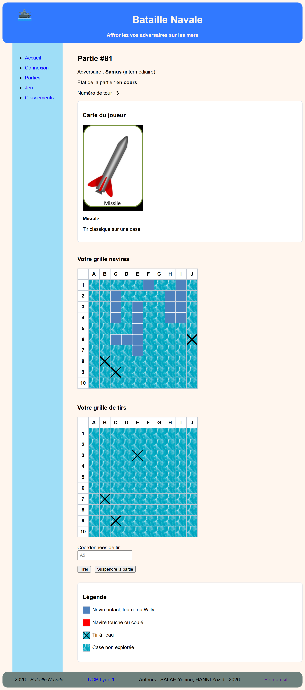

# Bataille Navale



Application web de bataille navale realisee en Python, Jinja2 et PostgreSQL dans le cadre universitaire de l'UE **Base de donnees et programmation web**.

Le projet propose une version jouable de la bataille navale contre des adversaires virtuels, enrichie par un systeme de cartes qui modifie le deroulement des tours. Il met l'accent sur la manipulation d'une base PostgreSQL, la construction de vues web dynamiques et la persistance complete de l'etat d'une partie.

Le depot public contient les fichiers necessaires au lancement de l'application web : `server.py`, `requirements.in`, `config-bd.toml`, `bataille_navale/routes.toml`, les controleurs, les templates, les assets statiques, le modele Python et les scripts SQL. Le projet est donc executable depuis ce depot apres installation des dependances. Le fichier `config-bd.toml` est deja configure pour le projet et doit etre conserve tel quel pour le lancement standard.

## Apercu

Dans cette application, un joueur humain peut se connecter, creer ou reprendre une partie, choisir un adversaire virtuel selon son niveau, puis jouer sur une grille 10 x 10. Chaque tour tire une carte qui peut produire un effet particulier : tir classique, second tir, verification d'une case, protection d'un navire, leurre, Willy, tir de zone, passage de tour ou malus.

Le jeu conserve l'avancement des parties en base de donnees, ce qui permet de suspendre puis reprendre une partie sans perdre l'etat des grilles, des cartes, des tirs et des navires.

## Fonctionnalites

- Connexion par selection ou creation d'un joueur humain.
- Creation d'adversaires virtuels avec plusieurs niveaux : faible, intermediaire et expert.
- Creation, suspension et reprise de parties.
- Grilles de bataille navale 10 x 10 avec affichage des navires, tirs, touches et cases non explorees.
- Placement automatique des flottes.
- Moteur de jeu avec cartes speciales :
  - Missile
  - Rejoue une fois
  - Vide ou pas vide ?
  - Meme pas mal
  - Bateau leurre
  - Sauver Willy
  - Mega-bombe
  - Etoile de la mort
  - Passe ton tour
  - Oups
- Intelligence de l'adversaire virtuel avec ciblage des cases et suivi des impacts.
- Statistiques joueur sur la page d'accueil.
- Classements IJH et CPP filtrables par periode.
- Schema SQL complet avec donnees d'exemple.
- Tests unitaires sur les fonctions principales du modele de jeu.

## Technologies

- **Python 3.11+** : serveur web, controleurs et logique metier.
- **PostgreSQL** : stockage relationnel du jeu, des joueurs, des parties, des tirs et des classements.
- **psycopg 3** : connexion et requetes SQL.
- **Jinja2** : templates HTML.
- **TOML** : configuration des routes et de la connexion a la base.
- **unittest** : tests automatises.

## Structure du projet

La structure ci-dessous correspond a la version publiee du projet, avec le serveur pedagogique inclus.

```text
.
|-- server.py                         # Serveur HTTP pedagogique
|-- config-bd.toml                    # Configuration PostgreSQL du projet
|-- requirements.in                   # Dependances Python
|-- bataille_navale/
|   |-- init.py                       # Initialisation de l'application
|   |-- routes.toml                   # Declaration des routes
|   |-- creation_tables.sql           # Schema SQL et donnees initiales
|   |-- requetes_demandees.sql        # Requetes SQL documentees
|   |-- controleurs/                  # Controleurs des pages
|   |-- model/model_pg.py             # Modele PostgreSQL et moteur de jeu
|   |-- templates/                    # Templates Jinja2
|   `-- static/                       # CSS et images des cartes/grilles
`-- tests/
    `-- test_model_pg.py              # Tests unitaires du modele
```

## Installation

Ces etapes installent l'environnement Python du serveur. Elles ne sont normalement a realiser qu'une seule fois.

Prerequis : Python 3.11 ou une version superieure.

Verifier la version de Python :

```bash
python --version
```

1. Cloner le depot puis entrer dans le repertoire du projet :

```bash
git clone https://github.com/yazid636/projet_bdw.git
cd projet_bdw
```

2. Creer l'environnement virtuel attendu par le serveur :

```bash
python -m venv .vebdw
```

3. Activer l'environnement virtuel.

Sous Linux ou macOS :

```bash
source .vebdw/bin/activate
```

Sous Windows :

```bat
.vebdw\Scripts\activate.bat
```

4. Mettre `pip` a jour puis installer les dependances :

```bash
python -m pip install --upgrade pip
python -m pip install -r requirements.in
```

Le fichier `config-bd.toml` fourni est deja configure pour la base du projet. Il ne faut pas le modifier pour lancer l'application dans le contexte prevu.

## Lancement

Depuis la racine du projet, apres activation de l'environnement virtuel :

```bash
python server.py bataille_navale
```

Le serveur expose le site sur le port par defaut `4242`. Pour visualiser l'application, rendez-vous sur :

```text
http://localhost:4242/
```

Verification effectuee sur la version locale : le serveur charge les 7 routes, se connecte a PostgreSQL avec la configuration fournie et demarre correctement sur un port local.

## Tests

Les tests unitaires peuvent etre lances avec :

```bash
python -m unittest discover -s tests
```

Ils couvrent notamment la conversion des coordonnees, la generation des tirs de cartes, le placement des navires, la serialisation des cartes, la construction des grilles et plusieurs messages de jeu.

## Points techniques notables

- Etat de partie stocke en JSON dans PostgreSQL pour conserver finement la progression du moteur de jeu.
- Separation entre routes, controleurs, templates et modele de donnees.
- Utilisation de requetes SQL parametrees avec `psycopg`.
- Gestion des sequences temporelles pour suivre le debut et la fin des parties.
- Calculs de statistiques et classements directement a partir des donnees relationnelles.
- Compatibilite avec les anciennes parties via reconstruction d'un etat minimal lorsque l'etat JSON est absent.

## Fichiers generes

Les repertoires generes automatiquement comme `__pycache__/` ou `.vebdw/` n'ont pas vocation a etre versionnes.

## Contexte universitaire

Ce projet a ete realise dans le cadre de l'UE **Base de donnees et programmation web**. Il combine conception relationnelle, requetes SQL, programmation serveur en Python et rendu web avec templates.

## Contributeurs

- Yazid HANNI
- Yacine SALAH
